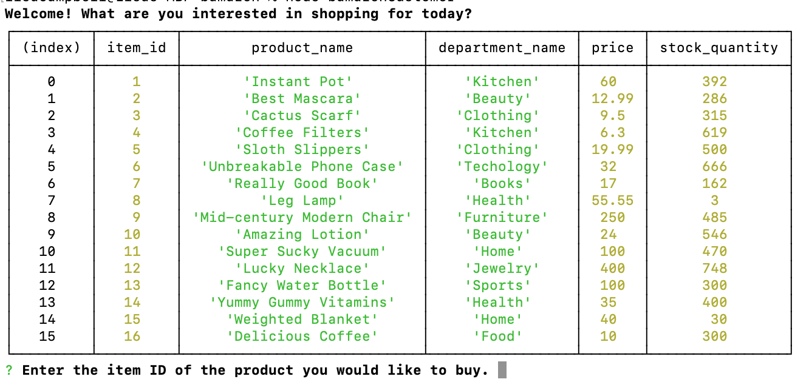

# Bamazon
### Where product purchases, inventory updates, and dreams are made.
This command line application makes it easy for customers to shop and for managers to add and check product inventory by connecting to a product database to keep the inventory neatly organized and accurate.

**In the customer app, you can:**
* View all products in the inventory, along with prices, departments, and number of items in stock.
* Select a product, see their total purchase amount, and choose to purchase or cancel.
* Keep customers from purchasing more items than the stock quantity allows.
* Prompt them to continue shopping after a purchase has been made.
* Update the stock quantity after each purchase.

## [Video demo:](https://youtu.be/0GPg0lCjxj8)
 

## In the manager app, you can:
* View all products and their details in the inventory
* View only the low inventory items (fewer than 5 in stock)
* Update the stock of any item
* Add new products, along with their prices, department, and stock quantity, to the database

## Technologies Bamazon incorporates:
* Node, including these packages:
    * [mysql](https://www.npmjs.com/package/mysql): to connect to the Sequel Pro database.
    * [inquirer](https://www.npmjs.com/package/inquirer): for prompting the user with questions and receiving user input.
    * Javascript: written by Lisa Campbell